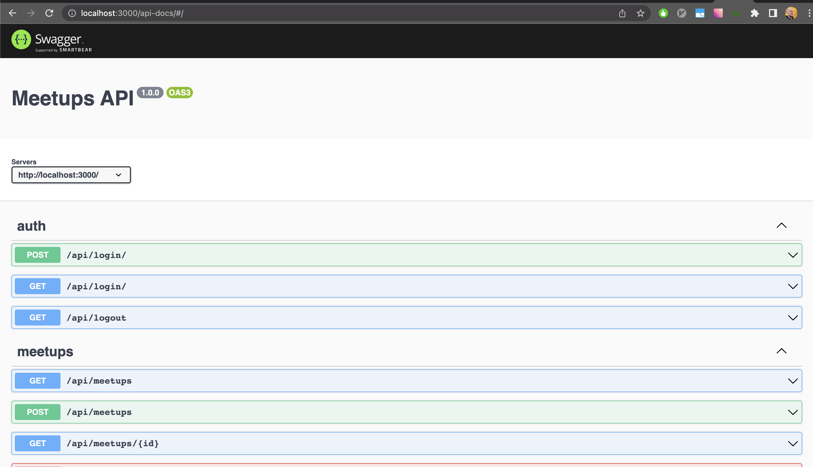
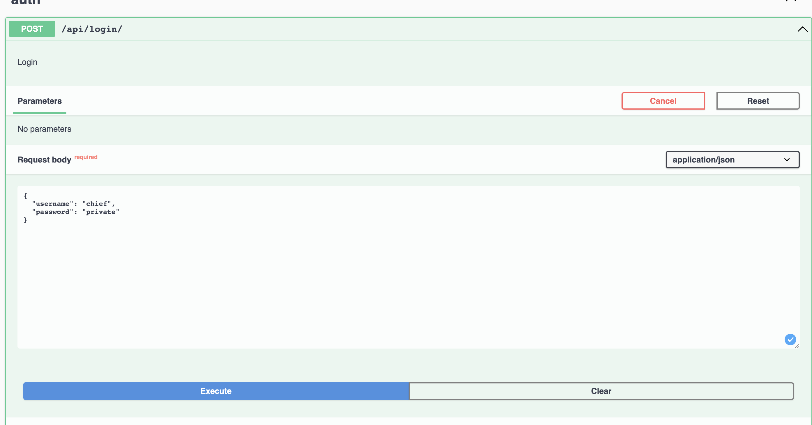
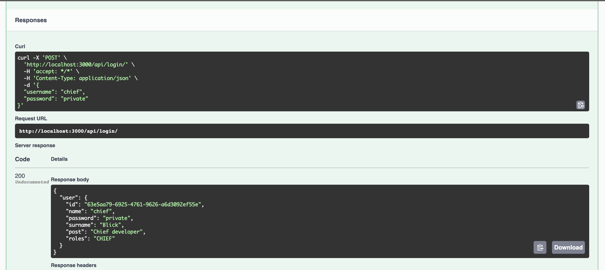

# Api servers for meetups

Simple meetups's API server on `Express.js` using local database`lowdb`. Have only basic meetups functionality like auth and CRUD for meetups and news. Main purpose to use it for internships and workshops as ready API server.

- Tech stack: `Express.js`
- [Board](https://gl.sam-solutions.net/fe/internship-meetups-api/-/boards/36)

Node version see in `.nvmrc` file

## Build with

- [Node.js](https://nodejs.org/)
- [Express.js](https://expressjs.com/) - web framework for Node.js
- [lowdb](https://github.com/typicode/lowdb) - local JSON database
- [faker.js](https://github.com/faker-js/faker) - Data generator for testing and development.
- [passport.js](https://www.passportjs.org/) - authentication middleware
- [swagger](https://github.com/scottie1984/swagger-ui-express) - API documentation tool

### What is `.mjs` file

> Node.js treats JavaScript code as CommonJS modules by default. Authors can tell Node.js to treat JavaScript code as ECMAScript modules via the .mjs file extension, the package.json "type" field, or the --input-type flag.

https://nodejs.org/api/esm.html#modules-ecmascript-modules

### How to run

Use node version from `.nvmrc`. If you use `nvm` or `nvm-windows`, simple run `nvm use` in the terminal. If required node.js version is not installed follow instruction from terminal

Run `node index.mjs` in the terminal.

### How to stop

Press `ctrl+c` in the terminal.

### How to reset database

- Stop server
- Remove file `db.json`
- Start server

You can edit db.json manually.

### Project structure

- `index.js` - entry point where app inits.
- `db.json` - Data base file. It will be generated on the first server run. Do not commit it
- `auth.mjs` - Auth strategy configuration
- `ensureAthenticated.mjs` - router middleware for restricting endpoint access by only authenticated users
- `generateInitialData.mjs` - script that seed empty database on the first app run
- `data/*.mjs` - data generators
- `routes/*.mjs` - endpoints for specific futures

### API documentation

When server is started open `http://localhost:3000/api-docs`


Now you can find all available endpoints with description. Additionally you can try them out.

For example do login

And see response



## How to add new functionality
Each meetups has the meta property that can be used to add additional data to extend functionality without changing server code. For example tags, comments. Just add needed property when sending create/update meetups request.
Example
```js
const meetups =  {
    "id": "c8dac226-0823-4ab9-a031-28a1f86c8005",
    "modified": "2022-02-28T04:06:13.007Z",
    
    //...
    "isOver": false,
    "meta": {
        tags: ['front-end', 'js'],
        comments: []
    }
};

```
